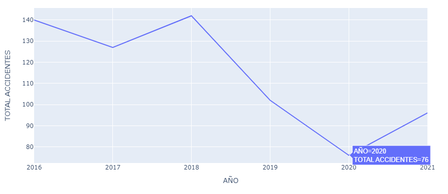
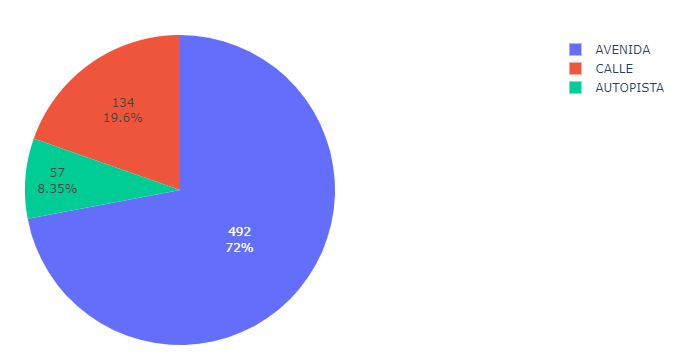
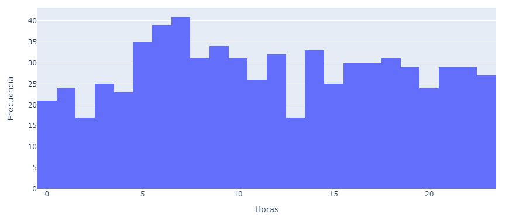
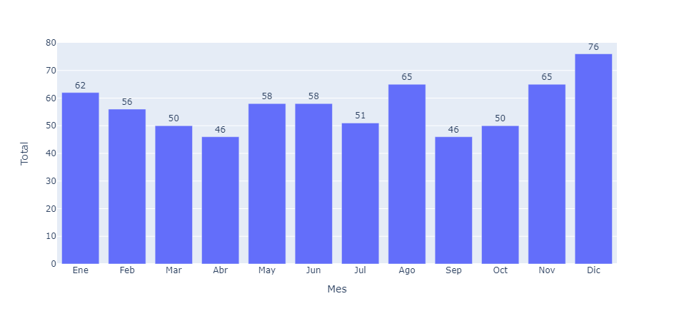
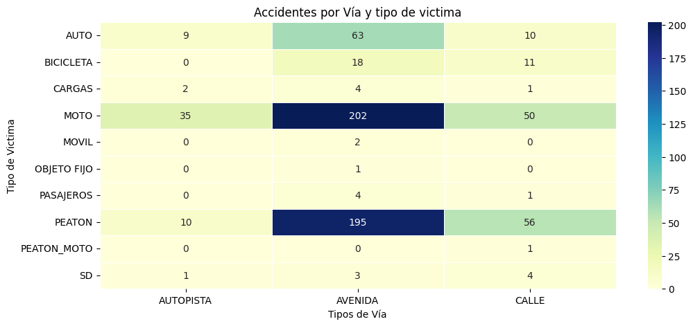

<h1 align='center'>Data Analytics</h1>
<h2 align='center'>
 <b>PROYECTO INDIVIDUAL Nº2 - Siniestros viales</b>
</h2>

<h2>Archivos incluidos en el repositorio</h2>
<ul>
    <li><b>homicidios.slxl:</b> Archivo original del dataset.</li>
    <li><b>EDA.ipnyb:</b> Incluye el EDA realizado al dataset.</li>
    <li><b>homicidios.csv:</b> Dataset resultante de aplicar algunas transformaciones, es el que se usa para la creación del dashboard</li>
    <li><b>NOTAS_HOMICIDIOS_SINIESTRO_VIAL.pdf:</b> Archivo pdf con información sobre el dataset</li>
</ul>
<h2>Contexto</h2>

Los siniestros viales, también conocidos como accidentes de tráfico o accidentes de tránsito, son eventos que involucran vehículos en las vías públicas y que pueden tener diversas causas, como colisiones entre automóviles, motocicletas, bicicletas o peatones, atropellos, choques con objetos fijos o caídas de vehículos. Estos incidentes pueden tener consecuencias que van desde daños materiales hasta lesiones graves o fatales para los involucrados.

En el contexto de una ciudad como Buenos Aires, los siniestros viales pueden ser una preocupación importante debido al alto volumen de tráfico y la densidad poblacional. Estos incidentes pueden tener un impacto significativo en la seguridad de los residentes y visitantes de la ciudad, así como en la infraestructura vial y los servicios de emergencia.

<h2>Fuente de datos</h2>

El <a href="https://data.buenosaires.gob.ar/dataset/victimas-siniestros-viales">Dataset</a> utilizado es proporcionado por el Ministerio de Transporte de Argentina a través de la página web del gobierno de Argentina, contiene información sobre Homicidios en siniestros viales ocurridos en la Ciudad de Buenos Aires. Los datos incluyen fecha, ubicación del hecho, tipo de transporte involucrado entre otros datos.

<h2>Objetivo del proyecto</h2>

En mi rol como Data Analyst, mi objetivo es construir un Dashboard que permita al Gobierno de Argentina disponer de información clara y precisa para tomar acciones que lleven a la disminución de los siniestros  viales.
En este rol, las actividades que realicé fueron: 
<ul>
    <li>EDA (Análisis Exploratorio De Los Datos), comprendiendo la estructura y complejidad de los mismos</li>
    <li>Preparar y limpiar los datos.</li>
    <li>Elaboración del Dashboard./li>
</ul>
<h2>Tecnologías usadas</h2>
<ul>
    <li>Pandas: Biblioteca de Python utilizada para la manipulación y análisis de datos</li>
      
    <li>Seaborn, Plotly: Bibliotecas de Python utilizadas para la visualización de datos</li>
      
    <li>Power BI: Plataforma de análisis de negocios que frece una variedad de herramientas y servicios para la visualización de datos y creación de informes</li>
</ul>
<h2>KPIs</h2>

En la elaboración del Dashboard se tienen en cuenta los siguientes KPIs

<ul>
    <li><b>Tasa de homicidios en siniestros viales de los últimos seis meses:</b> El objetivo es medir la tasa de homicidios semestral, comparando el semestre a analizar con el anterior y evaluar si se ha reducido o no en un 10%.</li>
     
    <li><b>Cantidad de accidentes mortales de motociclistas en siniestros viales:</b> El objetivo es evaluar si se ha reducido o no en un 7% la cantidad de accidentes mortales de motociclistas en el último año, en CABA, respecto al año anterior</li>
     
    <li><b>Cantidad de accidentes en la que las víctimas fueron los peatones:</b> El objetivo es evaluar si se ha reducido o no en un 10% la cantidad de accidentes mortales de peatones en el último año, en CABA, respecto al año anterior</li>
</ul>
<h2>Hallazgos</h2>
<ul>
    <li>Se observa una disminución  considerable de accidenres respecto a los años anteriores, esto se relaciona con el inicio de la pandemia COVID 19 y las medidas tomadas por el gobierno</li>
    
    <li>El mayo número de accidentes se concentra en las avenidas</li>
    
    <li>Ocurren más accidentes entre las 5:00 - 7:00 horas</li>
    
    <li>El mes con más accidentes es Diciembre, esto puede estar relacionado con las celebraciones de las fiestas de este mes</li>
    
    <li>Para los 3 tipos de vías las 2 principales víctimas suelen ser las motos y los peatones</li>
    
</ul>

